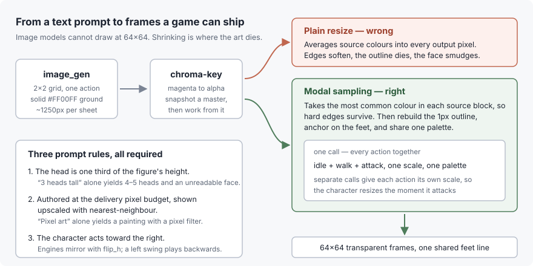
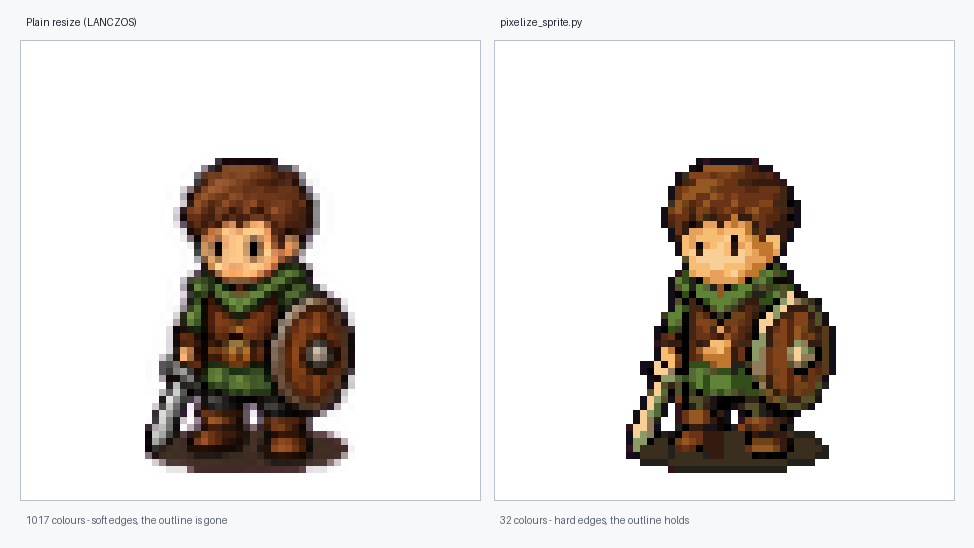
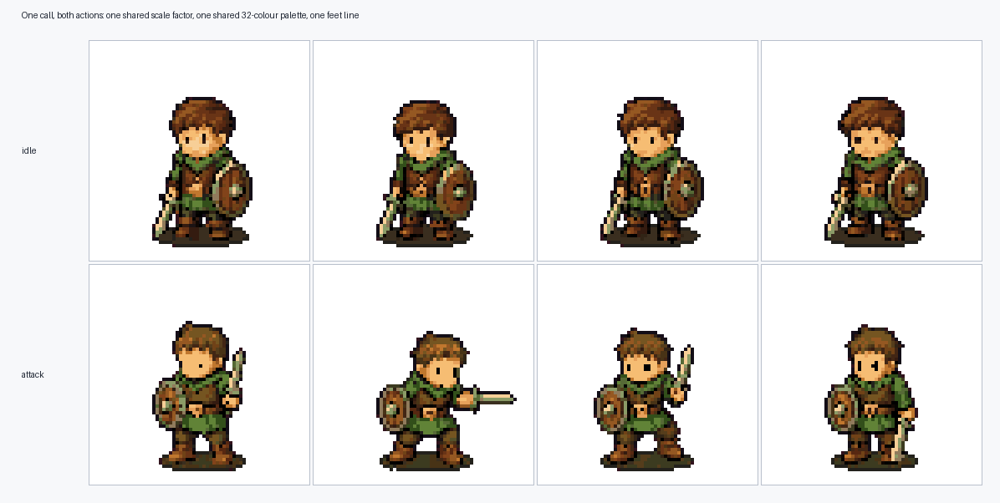

# fft-battle-sprite

An agent skill for generating Final Fantasy Tactics style low-resolution pixel
battle sprites — idle, walk and attack — for a game character.

Works with **Claude Code** and **Codex CLI**.



## The problem it solves

Image generation models cannot draw at 64×64. They render something large and
you downscale it. Done naively that yields mush: the model produces a
high-resolution painting with a pixel-art *look*, and a normal resize averages
several source colours into every output pixel, so edges soften, the 1px outline
disappears and the face becomes a smudge.



Same source cell, same target size. The left is what you get from a resize call.
The right is what this skill delivers.

This repository carries the prompt clauses that make generated art survive the
reduction, the postprocessing that preserves it, and a catalogue of the failure
modes that each cost a full generation cycle to discover.

## Example

The sprites above and below are the repository's own worked example — a generic
wandering swordsman, generated and processed with exactly the workflow in
`SKILL.md`. Both actions went through **one** downscale call, which is what
gives them a shared scale factor, a shared palette and a common feet line.



Reproduce it yourself from the shipped masters:

```sh
python3 scripts/pixelize_sprite.py \
  --sheet examples/masters/idle-2x2.png:2:2:idle_0,idle_1,idle_2,idle_3 \
  --sheet examples/masters/attack-2x2.png:2:2:attack_0,attack_1,attack_2,attack_3 \
  --cell 64 --colors 32 --out /tmp/out
```

The output is byte-for-byte identical to `examples/frames/`. That determinism is
the point: masters plus a command line reproduce the delivered art, so you can
change the delivery size or the palette later without paying for a new
generation.

An earlier attempt at this same example failed twice, and both fixes are now in
the prompt template. Its ground shadow came out magenta, because the prompt
named the background colour but never the shadow's, so the model shaded one into
the other. And its sword was drawn fully extended, which inflated the frame's
bounding box until the pose no longer fit its cell — the downscaler refused it
rather than clipping silently. Naming the shadow colour and asking for a compact
silhouette fixed both. See
[`references/failure-modes.md`](references/failure-modes.md).

## Install

From the project you want the skill in:

```sh
npx github:jhihweijhan/fft-battle-sprite
```

That installs it for both agents:

| Agent | Location |
|---|---|
| Claude Code | `.claude/skills/fft-battle-sprite` |
| Codex CLI | `.codex/skills/fft-battle-sprite` |

```
--claude        Claude Code only
--codex         Codex CLI only
--link          One copy in .agents/skills, symlinked from both
--dir <path>    Install into another project root
--force         Overwrite an existing installation
```

It refuses to overwrite an existing installation unless you pass `--force`, so a
skill directory you have edited locally is safe.

### As a submodule

If you want the skill to track upstream, add it as a submodule and symlink both
agents at it:

```sh
git submodule add https://github.com/jhihweijhan/fft-battle-sprite .agents/skills/fft-battle-sprite
mkdir -p .claude/skills .codex/skills
ln -s ../../.agents/skills/fft-battle-sprite .claude/skills/fft-battle-sprite
ln -s ../../.agents/skills/fft-battle-sprite .codex/skills/fft-battle-sprite
```

Clones then need `--recursive`, or a later `git submodule update --init` —
without it those symlinks point at an empty directory and the skill silently
does not exist.

### Requirements

The downscaler needs Python 3.10+ with `pillow` and `numpy`
(`pip install -r requirements.txt`).

Image generation itself requires an agent with a built-in image tool. Codex CLI
has `image_gen`; Claude Code does not, and can run the postprocessing half only.

## Contents

| Path | What it is |
|---|---|
| `SKILL.md` | The workflow, the three prompt rules, and the prompt template |
| `references/failure-modes.md` | Each failure, its cause, its fix, and how to catch it early |
| `scripts/pixelize_sprite.py` | Modal-sampling downscaler with outline rebuild, feet anchoring and a shared palette |
| `examples/` | The worked example: full-resolution masters and the delivered frames |
| `bin/install.mjs` | The `npx` installer |

## The downscaler

```sh
python3 scripts/pixelize_sprite.py \
  --sheet idle-clean.png:2:2:idle_0,_a,_b,_c \
  --sheet walk-clean.png:2:2:walk_0,walk_1,walk_2,walk_3 \
  --sheet attack-clean.png:2:2:attack_0,attack_1,attack_2,attack_3 \
  --cell 64 --colors 32 --out out/
```

Each `--sheet` is `PATH:ROWS:COLS:NAME[,NAME...]`, naming cells in reading
order; names starting with `_` are discarded. Input sheets must already be
transparent, so chroma-key first.

It samples the **modal** colour of each source block rather than the mean, which
keeps hard edges; rebuilds the 1px dark outline that downscaling erodes; anchors
frames on the feet so a reaching pose does not shove the body sideways; and puts
every frame on one shared palette so colours do not shimmer between frames. It
exits non-zero rather than silently clipping when a pose cannot fit its cell.

Pass every action in a single invocation — that is what makes the scale factor
and the palette shared. Separate runs give each action its own, and the
character will change size when it attacks.

Requires Python 3.10+ and the packages in `requirements.txt` (`pillow`,
`numpy`).

## Not for

Portraits, map props, UI, or anything meant to stay at illustration resolution.
This is specifically for small sprites that must stay legible after a large
reduction.

## Licence

MIT. See `LICENSE`.
